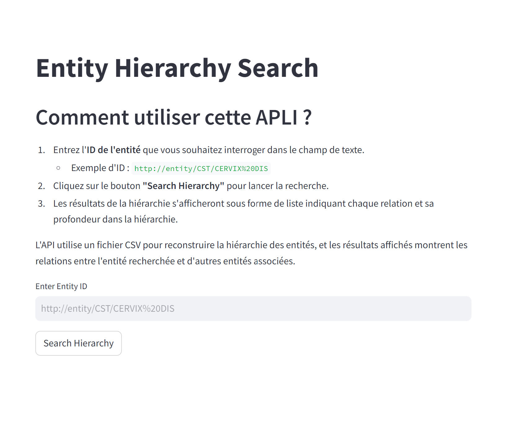
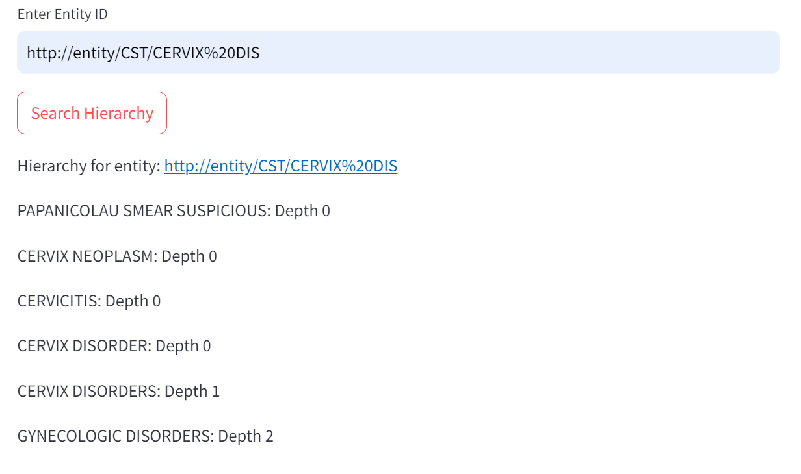
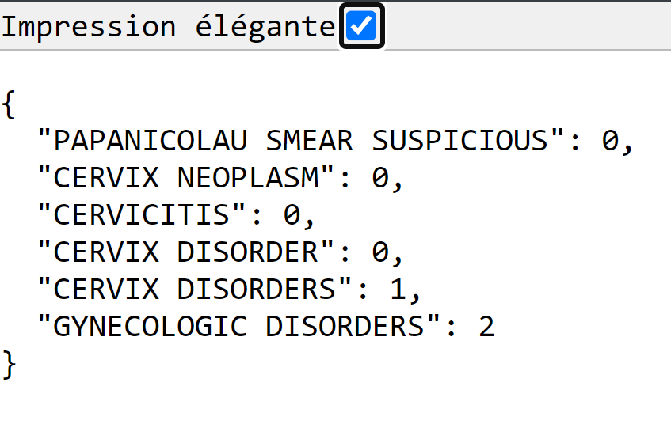

# Onto-X Project

This project is designed to parse a CSV file containing an ontology of pathologies and retrieve the hierarchy of related pathologies (parents, siblings) based on a given entity.








## Project Structure

- `src/`: Contains the source code
  - `parsing.py`: Includes the function to parse the CSV file
  - `hierarchy.py`: Contains the functions to retrieve the hierarchy of entities
  - `main.py`: The main script to run the program
  - `streamlit_app.py`: Streamlit interface to interact with the FastAPI API 
  - `api.py`: FastAPI backend for handling entity queries.
- `images/`: Contains the demo images for the README 
- `data/`: Contains the CSV data 
- `Dockerfile` : Contains the necessary steps to build an image of the project, including installing dependencies, copying source files
- `requirements.txt` : Contains the list of the Python dependencies for the project.
- `arborescence.txt` : Contains the structure of the project in the form of a tree, and was generated with the following command : ```tree /F > arborescence.txt```

## Setup Instructions to run the app on your machine

1. Clone the repository.
```
https://github.com/joctet/onto_x_project.git
```
2. Go to the folder data-engineer-technical-test 
```
cd data-engineer-technical-test
```
3. Create a virtual environment:
```
python -m venv venv
source venv/bin/activate  # Sur Linux/macOS
venv\Scripts\activate     # Sur Windows
```
4. Install the project dependencies:
```
pip install -r requirements.txt
```
5. Place your CSV file in the `data/` folder if it's not already there 
6. The main script will launch the FastAPI server and the Streamlit server.
To start the application, run the main script  `main.py` from the root directory:
   ```
   python src/main.py
   ```
7. Access the Streamlit interface : http://localhost:8501/
Or request  the FastAPI API, with an entity_id (such as http://entity/CST/CERVIX%20DIS for instance) at the following endpoint :
http://localhost:8000/entity?entity_id=http://entity/CST/CERVIX%20DIS


## Setup Instructions to run the app with Docker

### Build the Docker image :

```
docker build -t ontology-api
```
You can check that the image is present with the following command :
```docker images``` 
You should see an image named "ontology-api".

### Then run the Docker container:

```
docker run -p 8000:8000 ontology-api
```

### Access the API by going to http://localhost:8000 in your browser and query the API :

http://localhost:8000/entity?entity_id=http://entity/CST/CERVIX%20DIS
You can replace the entity_id with the entoty_id you choose, here we have entity_id = http://entity/CST/CERVIX%20DIS

### Stopping the Docker Container :

To stop the running container, press Ctrl + C in the terminal where it is running.

## Entity Hierarchy Search

This application provides two interfaces for exploring entity hierarchies: a FastAPI backend for API queries and a Streamlit interface for exploring the entity hierarchy through a simple web interface.

### Features:

* FastAPI API: Provides a REST API to retrieve the hierarchical relationships for a given entity.
* Streamlit Interface: Allows users to input an entity ID and visualize its hierarchical relationships directly in a web interface.

#### Start the FastAPI server:

```
uvicorn src.api:app --reload
```
The server will be accessible at http://localhost:8000.

#### Available Endpoints:

GET /entity: This endpoint allows you to retrieve the hierarchy for a given entity.

Query Parameter:

entity_id (str): The ID of the entity to search (e.g., http://entity/CST/CERVIX%20DIS).

Request example :
```
http://localhost:8000/entity?entity_id=http://entity/CST/CERVIX%20DIS
```
Response:

Returns a JSON dictionary with the hierarchical relationships and their corresponding depths.

{"PAPANICOLAU SMEAR SUSPICIOUS":0,"CERVIX NEOPLASM":0,"CERVICITIS":0,"CERVIX DISORDER":0,"CERVIX DISORDERS":1,"GYNECOLOGIC DISORDERS":2}

### Streamlit: User Interface for Entity Exploration

Start the Streamlit Application:
```
streamlit run streamlit_app.py
```
This will automatically open your browser at http://localhost:8501.

Using the Streamlit Interface:

* Input an entity ID in the text field (e.g., http://entity/CST/CERVIX%20DIS).
* Click on "Search Hierarchy" to retrieve and display the hierarchical relationships.
* The hierarchical relationships will be displayed as a list, indicating each relationship and its depth in the hierarchy.

#### Logs

* 200 OK: The request was successful, and the hierarchical relationships were returned.
* 404 Not Found: The entity ID was not found in the dataset.

## Key Points

### Pathology Hierarchy Retrieval

Each row in the CSV represents a pathology and its parent(s). For example, considering the provided sample for "CERVIX DISORDER", the hierarchy is structured as follows:

* GYNECOLOGIC DISORDERS has a depth of 2 (parent of the parent).
* CERVIX DISORDERS has a depth of 1 (direct parent).
* CERVICITIS, CERVIX NEOPLASM, and PAPANICOLAU SMEAR SUSPICIOUS have a depth of 0 (siblings).

#### Recursive Ancestor Retrieval
The get_ancestors_and_siblings function employs recursion to retrieve the full hierarchy of a pathology, tracing all parent entities up to the root.

#### Challenges Encountered
During development, I faced some challenges, such as an infinite loop when searching for siblings, and I had difficulty pinpointing the exact cause of the issue.

#### Time Spent
I dedicated several hours to completing the Hierarchy Retrieval script.

### Jupyter Notebook for Testing

I used jupyter notebook to code, debugg, and test all my scripts.

### Virtual Environment for Portability

I used a virtual environment to ensure the project’s dependencies are isolated, which makes the code easier to export and later integrate with Docker for containerization.

### Docstring documentation

Each function in the code is accompanied by detailed docstrings to ensure clarity and provide documentation directly within the codebase. The docstrings are currently written in french, and should be 

## Areas for improvement

* The docstrings are currently in French, but they should be written in English.
* The commits should contain only one keypoint at a time, note 3-4 like here.
* We could save the logs (for instance the success / failure logs from the streamlit & FastAPI APIs) to process them later or to analyse them.
* We could implement a "File Upload Functionality" on the API, to allow users to upload their own CSV files directly through the API and search for specific results within their dataset
* We could implement a serie of tests to ensure data integrity and correctness, for instance :
    * Unit Tests for CSV Data, that verify the structure, format, and content of the CSV files
    * Integration Tests, that simulate real-world scenarios where the API consumes CSV data and checks for expected responses. This ensures that the core functionalities of the API are working as expected with the provided data.
    * Edge Case Testing to test the API against empty CSV files, corrupted data, excessively large datasets.. etc..
* We could implement a CI/CD Pipeline to improve the overall workflow, with :
    * GitHub Actions for the continuous integration (automatic run of the tests, check of the code quality, and validatation of the project every time new changes are pushed)
    * GitHub Actions to automate the deployment of our application based on specific triggers (exemple : code push or pull request), or Airflow if the pipeline is complex
